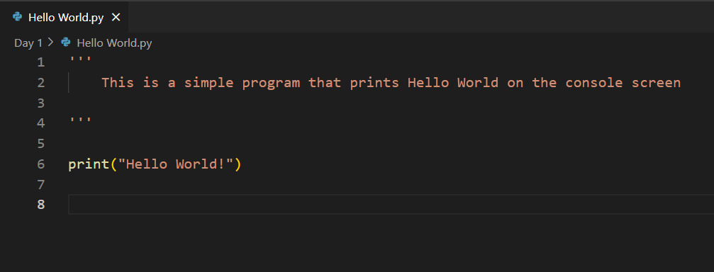
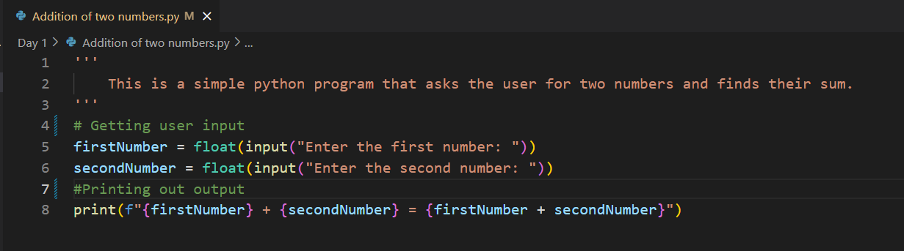
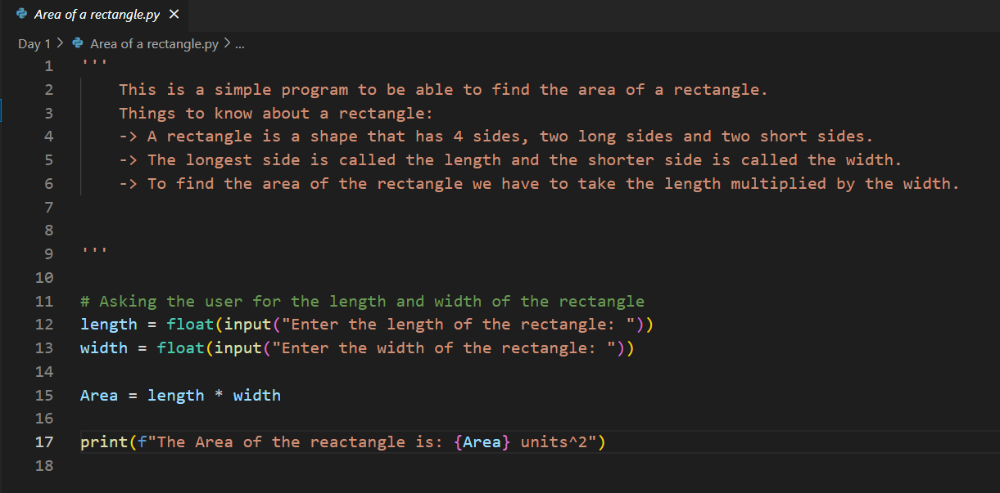

# 100 Days Coding Challenge in Python
Welcome to my 100 Days Coding Challenge in Python repository! This repository contains a collection of Python exercises and projects that I completed over the course of 100 days. The goal of this challenge is to enhance my Python programming skills by solving a variety of problems and working on different aspects of Python development.

# Repository Structure
The repository is organized into folders, each representing a specific day of the challenge. Each folder contains Python scripts that correspond to the exercises for that day. The challenge is structured as follows:

- Days 1 - 5: Basics
- Days 6 - 15: Conditional Statements
- Days 16 - 25: Loops
- Days 26 - 30: Strings
- Days 31 - 50: Python Data Structures (Lists, Tuples, Sets, Dictionaries)
- Days 51 - 60: Functions
- Days 61 - 70: File Handling
- Days 71 - 80: Python OOP
- Days 81 - 100: Others or Combination of All
# Navigate

Navigate to the desired day's folder to view the exercises and solutions.

Run the Python scripts using your preferred Python environment. For example:

- Clone the Repository: git clone: https://github.com/Maximus-Ay/100-days-Coding-Challenge-with-python.git

- Navigate to the Directory: cd 100-days-coding-challenge-with-python

- Run the Code: Explore the individual Python scripts in each section to see examples and explanations.

# Acknowledgements
This challenge is inspired by the 100 Days of Code initiative. Special thanks to the Python community for providing a wealth of resources and support.

# License
This project is licensed under the MIT License. See the LICENSE file for details.

# Extra

Below are the codes screenshots for my 100 days coding for each day. I officially started on the 1st July 2024
A way of starting the other half of the year in a better way.

# Day 1:
- Write a Python program to print "Hello, World!".

- Write a program to add two numbers and print the result.

- Write a program to calculate the area of a rectangle.

